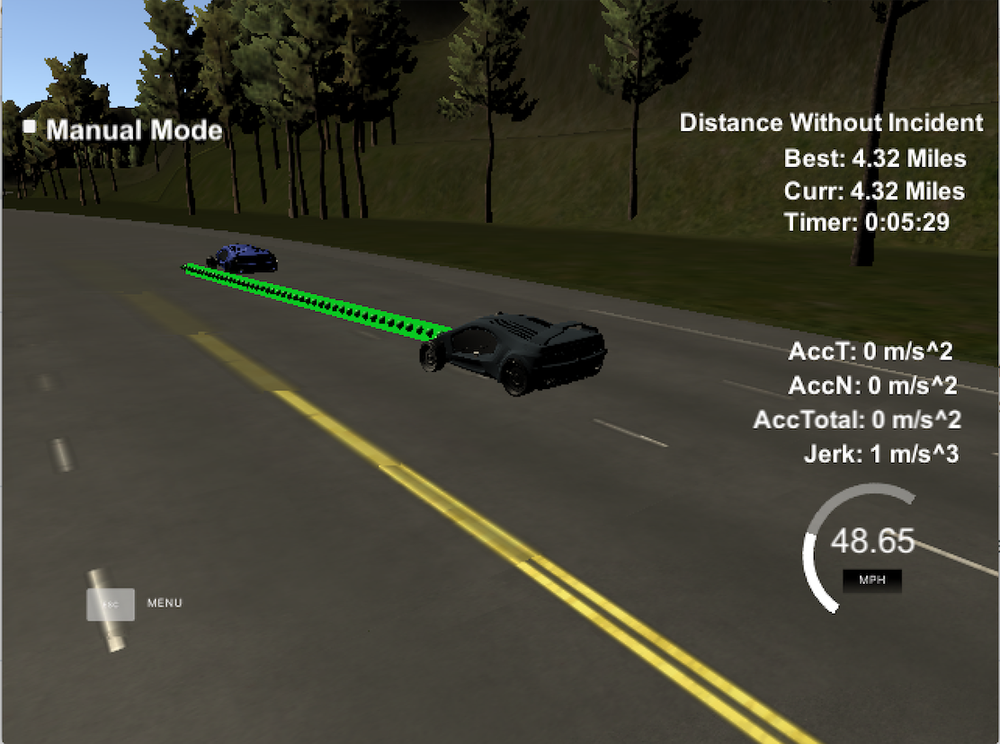

# Path-Planning for self-driving car

## Preface
This is Udacity's Nano-degree Course Program. The following contents are the copied instrunction. The original assignment can be found here (https://github.com/udacity/CarND-Path-Planning-Project).

### Goals
In this project the goal is to safely navigate around a virtual highway with other traffic that is driving +-10 MPH of the 50 MPH speed limit. You will be provided the car's localization and sensor fusion data, there is also a sparse map list of waypoints around the highway. The car should try to go as close as possible to the 50 MPH speed limit, which means passing slower traffic when possible, note that other cars will try to change lanes too. The car should avoid hitting other cars at all cost as well as driving inside of the marked road lanes at all times, unless going from one lane to another. The car should be able to make one complete loop around the 6946m highway. Since the car is trying to go 50 MPH, it should take a little over 5 minutes to complete 1 loop. Also the car should not experience total acceleration over 10 m/s^2 and jerk that is greater than 10 m/s^3.

### Simulator.
You can download the Term3 Simulator which contains the Path Planning Project from the [releases tab (https://github.com/udacity/self-driving-car-sim/releases).

### Basic Build Instructions

1. Clone this repo.
2. Make a build directory: `mkdir build && cd build`
3. Compile: `cmake .. && make`
4. Run it: `./path_planning`.

## Design of my approach

As soon as new data is streamed from the system(50Hz), this program executes the following 5 steps.

1. Create Interpolated Waypoints

The waypoints given in highway_map.csv file are spaced roughly 30
meters apart. This is too coarse to leverage to design the path
trajectory. Thus, this step interpolates a set of nearby map waypoints
to generate more accurate trajectory. Using 10 couarse waypoints
behind and ahead, this step produces a set of more detailed (0.5
meters interval) waypoints. (line 239 - 306 in main.cpp)

2. create car objects

The vehicle state and some methods are contained in the Vehicle
class.(vehicle.cpp) The newly streamed data is used to update the
vehicle object. The position and velocity is computed on both Cartesian x,y coodinated and Frenet s,d coodinates.

3. Generate Predictions for other cars.

The information fo the other cars surrounding the target car is also
received from the simulator in each iteration. Parsing this data, this
program predicts the trajectories for each of the other cars on the
road. Then, this information is used to judge if there is other cars
which may cause collision when changing lane.  In this step, the
potential takable actions are determined by simple rule logic to both
longitudinal and lateral distance.

4. Determine trajectory considering various factors

The trajectory is designed by jerk-minimizing (JMT) method based on
the target state and using the spline.h library. For each state, the
trajectory can be generated.

An optimal trajectory is wisely chosen using the 'cost'. This cost
indicates kind of a 'dangeraous score' when the action is taken. Thus,
the action which has the lowest cost is the better choice. There are
many potential factors which affect 'cost'(dagenrous level). In this
system, I simply implemented
 - Collision cost: penalizes a trajectory that collides with any predicted traffic trajectories.
 - Buffer cost: penalizes a trajectory that comes within a certain distance of another traffic vehicle trajectory.
 - In-lane buffer cost: penalizes driving in lanes with relatively nearby traffic.
 - Efficiency cost: penalizes trajectories with lower target velocity.
 - Not-middle-lane cost: penalizes driving in any lane other than the center in an effort to maximize available state options.
 Applyting the weight to each cost, the sum of them is considered as the 'cost'.

5. Create new path

The new path starts with a certain number of points from the previous
path, which is received from the simulator at each iteration. A spline
is generated beginning with the last two points of the previous path
that have been kept, and ending with two points 30 and 60 meters ahead
and in the target lane. This produces a smooth x and y trajectory. To
prevent excessive acceleration and jerk, the velocity is only allowed
increment or decrement by a small amount, and the corresponding next x
and y points are calculated along the x and y splines created earlier.

